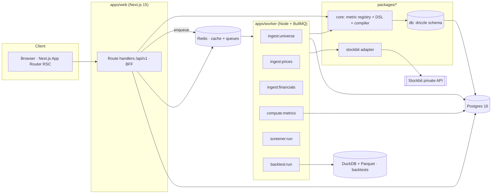

# Allstocks — Build Spec

Status: draft v1.0 · Target: IDX (Indonesia Stock Exchange), ~950 listed tickers · Single-tenant, self-hosted

---

## 1. Problem and scope

### 1.1 What we are building

A web app that answers one question every morning: **"Which stocks does each of my
screeners like today, and why?"**

It draws all market data from Stockbit and presents two families of screeners in a single UI:

- **Stockbit preset screeners** — screeners the user already saved inside Stockbit. Allstocks
  reads the saved-screener list, runs each one through Stockbit, and displays the resulting
  tickers enriched with locally computed metrics. Rule logic stays in Stockbit; Allstocks is a
  reader and a presentation layer.
- **Book screeners** — 15 screeners defined and executed *by Allstocks* against a local
  fundamentals warehouse, each traceable to a specific book and chapter, each criterion
  individually pass/fail-explained per stock. See [04-SCREENER-CATALOG.md](04-SCREENER-CATALOG.md).
- **Custom screeners** — user-authored screeners in the same DSL as the book screeners, built
  through a rule builder UI.

### 1.2 In scope (v1)

- IDX equities only. Daily-close granularity. No intraday, no order routing, no portfolio P&L.
- Nightly ingestion of universe, prices, corporate actions, and financial statements.
- Local metric layer (~130 metrics) with point-in-time correctness.
- Screener engine with explainability (per-criterion pass/fail + funnel).
- Consensus dashboard ("Today's Picks") across all enabled screeners.
- Per-stock detail page scoring the stock against every book screener.
- Backtests of book screeners against IHSG/LQ45 (M6).
- CSV/XLSX export of any result set.

### 1.3 Out of scope (v1)

- Trading, order placement, broker integration.
- Real-time / streaming quotes and websockets. Prices are end-of-day, plus an optional
  delayed last-price refresh on demand.
- Multi-tenant SaaS hosting, billing, public sharing of data pulled from Stockbit.
- Non-IDX markets (design keeps the door open; see §4.2 `MarketDataProvider`).
- Any form of automated advice, "buy" signals, or notifications framed as recommendations.

### 1.4 Non-negotiable constraint stated up front

Stockbit's data API is private and its terms of service very likely prohibit automated access
and redistribution. That is a real constraint on this product, not a detail: **v1 is built as a
personal, self-hosted tool authenticated with the operator's own Stockbit credentials, and it
must not redistribute Stockbit data.** Every data access goes through one provider interface so
a licensed vendor feed (or IDX's own filings) can be swapped in if the app is ever hosted for
others. Full treatment in [07-RISKS-AND-COMPLIANCE.md](07-RISKS-AND-COMPLIANCE.md).

---

## 2. Users and stories

Single persona in v1: **the operator** — a retail Indonesian investor with a Stockbit account
who reads investing books and wants their rules applied consistently.

| # | Story | Acceptance |
| --- | --- | --- |
| U1 | See every screener's picks for today on one page | Dashboard lists all enabled screeners with match counts, top names, and diffs vs. the previous run |
| U2 | See which stocks pass several screeners at once | Consensus table sorted by number of passing screeners, with the screener badges shown |
| U3 | Open a screener and understand exactly why each name is in the list | Result row expands into per-criterion pass/fail with the actual metric value and threshold |
| U4 | See why a stock I expected is *not* in the list | Funnel view + "test a ticker against this screener" input returning the first failed criterion |
| U5 | Run my Stockbit preset screener without leaving the app | Presets appear in the screener list, run on demand, show Stockbit-returned tickers plus local metrics |
| U6 | Compare a book screener's picks against my preset's picks | Set operations view: intersection / only-A / only-B between any two screeners |
| U7 | Judge one stock against all book screeners | Stock page shows a scorecard row per screener with pass/fail and near-miss distance |
| U8 | Trust the numbers | Every metric shows its as-of date, source statement period, and publication date on hover |
| U9 | Change a threshold and see the effect | Screener detail exposes editable parameters; re-runs live with a count preview before commit |
| U10 | Know if a screener has historically worked | Backtest tab: equity curve vs. IHSG, CAGR, max drawdown, turnover, per-year returns |

---

## 3. Architecture



### 3.1 Repository layout

```
allstocks/
├── apps/
│   ├── web/                 # Next.js 15 App Router — UI + /api/v1 BFF
│   └── worker/              # BullMQ workers: ingestion, metrics, screener, backtest
├── packages/
│   ├── core/                # metric registry, screener DSL, DSL→SQL compiler, scoring
│   ├── stockbit/            # Stockbit adapter: auth, endpoints, DTO→canonical mappers
│   ├── db/                  # drizzle schema, migrations, seed, query helpers
│   ├── ui/                  # shadcn-based component library
│   └── config/              # eslint, tsconfig, tailwind presets, zod env schema
├── screeners/               # versioned screener definition JSON (ships with the app)
├── fixtures/                # recorded Stockbit responses for contract tests
├── docs/                    # this spec
└── infra/
    ├── docker-compose.yml   # postgres, redis, app, worker (local + self-host)
    └── migrations/
```

### 3.2 Stack decisions

| Layer | Choice | Why |
| --- | --- | --- |
| Language | TypeScript everywhere (Node 22) | One language across UI, BFF, workers, and screener logic; the screener DSL types are shared literally, not duplicated |
| UI | Next.js 15 App Router, React 19, Tailwind v4, shadcn/ui | RSC lets big result tables render server-side against Postgres with no client fetch waterfall |
| Tables | TanStack Table v8 + virtualization | 950 rows × 40 columns, sortable/pinnable, no pagination needed |
| Charts | ECharts (via echarts-for-react) | Candlesticks, equity curves, and heatmaps in one library; better perf than Recharts at this data volume |
| Data fetching | TanStack Query for mutations/polling only | Reads are RSC; only run-status polling and live count previews are client-side |
| BFF | Next route handlers + zod-validated contracts | Avoids a second HTTP service; contracts generated from the same zod schemas the workers use |
| Jobs | BullMQ on Redis | Ingestion and backtests exceed serverless timeouts; needs retries, concurrency limits, and rate-limited queues (the Stockbit rate limiter lives in the queue, see §4.4) |
| OLTP | Postgres 16 (Neon/Supabase/local docker) | Screener execution is SQL; partitioned price tables; JSONB for raw statements |
| ORM | Drizzle | SQL-first, and the DSL compiler emits raw parameterized SQL anyway |
| Cache | Redis | Quote TTL cache, screener result cache keyed by `dsl_hash + as_of` |
| Analytics/backtest | DuckDB over Parquet snapshots | 15 screeners × 10 years × monthly rebalance is a columnar workload; keeps Postgres free for serving |
| Auth (app) | Auth.js credentials, single user by default | Self-hosted; `ALLSTOCKS_MULTI_USER=false` is the default and disables sign-up |
| Validation | zod + JSON Schema (generated) | One source of truth for the screener DSL, usable by the UI builder and by hand-authored JSON |
| Tests | vitest, Playwright, testcontainers-postgres | See §9 |

### 3.3 Why the book screeners are computed locally, not pushed into Stockbit

Stockbit's own screener is a fixed-field filter engine. The book screeners need multi-year
consecutive-period tests (Graham's "positive EPS ten years running"), cross-sectional composite
ranks (Magic Formula, Value Composite Two), derived forensic scores (Piotroski F, Altman Z,
Beneish M), and per-criterion explainability. None of that survives translation into someone
else's filter UI. So: **presets are read from Stockbit; book screeners run on our warehouse.**
That split is the central architectural decision of the app.

---

## 4. Data layer

### 4.1 Sources

| Dataset | Source | Cadence | Notes |
| --- | --- | --- | --- |
| Universe / listings | Stockbit company list | daily | Board, sector (IDX-IC), listing date, shares outstanding |
| Daily OHLCV + value | Stockbit chart/history | daily after close (~17:00 WIB) | Unadjusted + adjusted; foreign net flow if exposed |
| Corporate actions | Stockbit + IDX announcements | daily | Splits, reverse splits, dividends, rights, bonus shares |
| Financial statements | Stockbit findata (quarterly & FY) | on publication, polled daily | Cumulative-YTD semantics — see §4.5 |
| Key stats / ratios | Stockbit keystats | daily | Used for reconciliation only, never as primary; we recompute |
| Index membership | Stockbit / IDX (LQ45, IDX30, IDX80, KOMPAS100, IDXV30, JII) | on rebalance (Feb/Aug) | Universe filters and benchmarks |
| Special-monitoring board | IDX daily list | daily | Hard exclusion for most screeners (full call auction, illiquid) |

### 4.2 Provider interface

Every read goes through one interface so Stockbit is replaceable:

```ts
interface MarketDataProvider {
  readonly id: 'stockbit' | 'idx' | 'vendor';
  listSecurities(): Promise<SecurityDTO[]>;
  getPriceHistory(t: Ticker, from: IsoDate, to: IsoDate): Promise<BarDTO[]>;
  getCorporateActions(t: Ticker, from: IsoDate): Promise<CorpActionDTO[]>;
  getFinancials(t: Ticker, opts: { from: FiscalPeriod }): Promise<StatementDTO[]>;
  getKeyStats(t: Ticker): Promise<KeyStatsDTO>;
  // preset screeners are Stockbit-only and live behind a capability flag
  capabilities: { presetScreeners: boolean; foreignFlow: boolean };
  listPresetScreeners?(): Promise<PresetScreenerDTO[]>;
  runPresetScreener?(id: string): Promise<PresetResultDTO>;
}
```

DTOs are provider-shaped; mappers in `packages/stockbit/map/*` convert them to the canonical
model. **No provider field name may appear outside `packages/stockbit`.**

### 4.3 Canonical schema

Full DDL in [sql/001_core.sql](sql/001_core.sql). Shape:

- `dim_security` — one row per listed instrument: ticker, name, board, IDX-IC sector/subsector,
  listing date, shares outstanding (current), free float %, shariah flag, active flag,
  `sector_class` (see §4.6), delisting date.
- `dim_index_membership` — `(security_id, index_code, valid_from, valid_to)`. Point-in-time
  membership; never a boolean on the security.
- `fact_price_daily` — `(security_id, trade_date, open, high, low, close, adj_close, volume,
  value_idr, frequency, foreign_buy_value, foreign_sell_value)`, range-partitioned by year.
- `fact_corporate_action` — `(security_id, ex_date, type, ratio_from, ratio_to, cash_amount,
  currency, announced_date)`.
- `fact_statement` — one row per **(security, fiscal period, report basis, revision)** holding
  the raw provider payload in JSONB *plus* typed columns for the ~90 line items we use.
  Carries `period_end`, `fiscal_period` (`Q1|H1|9M|FY`), `basis` (`consolidated|standalone`),
  `currency`, `publish_date`, `revision`, `is_audited`, `source_hash`.
- `fact_statement_quarter` — **derived**, discrete (non-cumulative) quarterly figures produced
  by the YTD-differencing rule in §4.5. All TTM math reads this table, never `fact_statement`.
- `fact_metric` — long form `(security_id, as_of_date, metric_key, value_num, basis_period_end,
  publish_date)`. Written by `compute:metrics`.
- `mv_metrics_latest` — wide materialized view, one column per metric key, generated by codegen
  from the metric registry. This is what screener SQL hits.
- `screener`, `screener_version`, `screener_run`, `screener_result`, `screener_result_criterion`
  — definitions, immutable versions, runs, ranked results, and per-criterion evidence.
- `stockbit_credential` — encrypted credential/token blob per app user (§8.2).
- `watchlist`, `watchlist_item`, `note`.
- `backtest`, `backtest_rebalance`, `backtest_position`, `backtest_stat`.
- `ingest_run`, `data_quality_finding`.

### 4.4 Ingestion pipeline

Nightly DAG (all steps idempotent, keyed by `source_hash`; re-running a day is a no-op):

```
21:00 WIB  ingest:universe      → dim_security upsert, detect new listings/delistings
21:10 WIB  ingest:prices        → fact_price_daily for the trading day (fan-out, rate-limited)
21:30 WIB  ingest:corpactions   → fact_corporate_action; triggers adj_close recomputation
21:40 WIB  ingest:financials    → poll tickers whose next filing window is open; upsert
                                  fact_statement; new revision => new row, never an update
22:00 WIB  derive:quarters      → fact_statement_quarter from YTD deltas
22:10 WIB  compute:metrics      → fact_metric for as_of = today; refresh mv_metrics_latest
22:30 WIB  qa:checks            → data_quality_finding (§4.7); hard-fail gate
22:40 WIB  screener:run (all)   → screener_run + screener_result for every enabled screener
23:00 WIB  snapshot:parquet     → export point-in-time metrics to Parquet for DuckDB
```

Failure policy: each step retries 3× with exponential backoff; a failed step blocks downstream
steps but never rolls back completed ones. `screener:run` refuses to run if `qa:checks` produced
a `severity=blocking` finding, and the dashboard shows the previous run with a staleness banner
instead of silently serving wrong picks.

### 4.5 The IDX quarterly-report rule (do not skip this)

IDX issuers file **cumulative year-to-date** income statements and cash-flow statements. A
"Q3 report" contains nine months, not three. Every TTM number in this app therefore comes from
differenced values:

```
Q1 = YTD(Q1)
Q2 = YTD(H1) − YTD(Q1)
Q3 = YTD(9M) − YTD(H1)
Q4 = YTD(FY)  − YTD(9M)
TTM(x) = Σ of the last four available discrete quarters, contiguous, no gaps
```

Rules the deriver enforces:

- Balance-sheet items are **never** differenced — they are point-in-time stocks. Only income
  statement and cash-flow items are.
- If any of the four quarters is missing, TTM is `NULL`, not an annualized guess. Screeners
  treat `NULL` as a failed criterion (§ DSL null policy), never as pass.
- FY figures are audited and frequently restate the earlier quarters. When a FY filing arrives,
  Q4 is derived from the audited FY minus the *as-filed* 9M, and a `restatement` quality finding
  is raised if the implied Q4 differs from the unaudited trend by more than 30%.
- Non-December fiscal years exist on IDX (a handful of issuers). `fiscal_year_end_month` on
  `dim_security` drives the calendar; nothing in the code assumes December.
- Currency: a few IDX issuers report in USD. `fact_statement.currency` is authoritative; the
  metric layer converts to IDR at the **period-end** rate for balance items and the
  **period-average** rate for flow items, and stores the rate used.

### 4.6 Sector classes and the financials exception

`dim_security.sector_class` ∈ `{ non_financial, bank, insurance, multifinance, property, reit,
utility_regulated, mining, holding }`. It drives metric applicability. Ratios that are
meaningless for banks (current ratio, EV/EBITDA, working capital, inventory turnover) are
`NULL` for `sector_class = bank`, and screeners either exclude banks or route them to a
**sector profile** — an alternate criterion set declared in the screener itself
(e.g. Graham Defensive's bank profile substitutes CAR ≥ 12%, LDR 78–92%, NPL ≤ 3%, ROE ≥ 12%
for the current-ratio and working-capital tests). See [03-SCREENER-DSL.md](03-SCREENER-DSL.md) §6.

### 4.7 Data quality gates

Automated checks after every ingestion, each producing a `data_quality_finding` row with
`severity ∈ {info, warning, blocking}`:

| Check | Severity |
| --- | --- |
| Balance sheet identity: `assets − liabilities − equity_total` within 0.5% | blocking |
| Equity total = attributable + non-controlling interest | blocking |
| Discrete quarter revenue negative | warning (legitimate for some reversals) |
| Discrete quarter revenue negative *and* magnitude > 20% of prior quarter | blocking |
| TTM coverage < 85% of universe by market cap | blocking (indicates a broken ingest) |
| Price gap > 25% on a day with no corporate action | warning; queues a corp-action re-fetch |
| Shares outstanding change > 5% with no corp action | warning |
| Metric recomputation drift vs. provider keystats > 10% on P/E, P/B, ROE | warning; reported on a reconciliation page |
| Statement `publish_date` missing | warning; fallback lag applied (§ 02 doc) |

---

## 5. Screener engine

Detailed in [03-SCREENER-DSL.md](03-SCREENER-DSL.md). Summary of the execution model:

1. A screener definition (JSON, validated against the generated JSON Schema) declares
   `universe`, `filters` (a boolean tree of criteria), optional `sector_profiles`,
   `rank` (single metric, sum-of-ranks composite, or weighted z-score), and `limit`.
2. The compiler lowers the definition into **one parameterized SQL statement** against
   `mv_metrics_latest` (plus CTEs for cross-sectional ranks and for consecutive-period tests
   that read `fact_metric` history). No per-row round trips, no application-side filtering.
3. Execution writes a `screener_run` and one `screener_result` per match, and — when
   `explain: true` — one `screener_result_criterion` row per (stock, criterion) for **every
   stock in the universe**, capped at the universe size. That is what powers the funnel, the
   near-miss list, and the "why isn't XYZ here" answer.
4. Results are cached in Redis under `sha256(definition) + as_of` and invalidated by a new
   `compute:metrics` run.

Performance target: p95 < 1.5 s for a 950-ticker universe with 12 criteria and a composite rank,
cold cache, on a 2 vCPU Postgres.

---

## 6. HTTP API (`/api/v1`)

All responses are JSON, `snake_case`, envelope `{ data, meta }`; errors are RFC 9457
problem+json. Every list endpoint takes `?limit&cursor`. All timestamps ISO-8601 with offset.

### Screeners
| Method | Path | Purpose |
| --- | --- | --- |
| GET | `/screeners` | List all screeners, grouped by `source` (`book` / `stockbit_preset` / `custom`); includes last run summary |
| GET | `/screeners/:slug` | Definition + human-readable criteria + citation + parameters |
| POST | `/screeners` | Create a custom screener (DSL body) |
| PATCH | `/screeners/:slug` | Edit definition → creates a new immutable `screener_version` |
| POST | `/screeners/:slug/preview` | Synchronous count-only run for the builder's live preview (no result rows) |
| POST | `/screeners/:slug/run` | Enqueue a run; `202` + `run_id` |
| GET | `/screeners/:slug/results?as_of=` | Ranked results with metric payload |
| GET | `/screeners/:slug/funnel?as_of=` | Survivor count after each criterion, in declaration order |
| GET | `/screeners/:slug/test?ticker=BBCA` | Per-criterion pass/fail for one ticker, including first failure |
| GET | `/screeners/:slug/history?from=&to=` | Entries/exits per run (for turnover and diffing) |
| POST | `/screeners/compare` | `{ a, b, as_of }` → intersection / only_a / only_b |
| GET | `/screeners/:slug/export?format=csv\|xlsx` | Streamed export |

### Picks & securities
| Method | Path | Purpose |
| --- | --- | --- |
| GET | `/picks?as_of=` | Consensus across enabled screeners: ticker, pass count, screener badges, key metrics, new/dropped flag |
| GET | `/securities?q=&sector=&index=` | Search / filter the universe |
| GET | `/securities/:ticker` | Profile + latest metrics + freshness metadata |
| GET | `/securities/:ticker/scorecard` | Pass/fail against every book screener, with near-miss distance per screener |
| GET | `/securities/:ticker/financials?basis=&periods=` | Discrete quarters + FY, as-reported and TTM |
| GET | `/securities/:ticker/prices?from=&to=&adjusted=` | OHLCV series |

### Stockbit link
| Method | Path | Purpose |
| --- | --- | --- |
| GET | `/stockbit/status` | Link state, token expiry, last successful call, current rate-limit budget |
| POST | `/stockbit/link` | Store credentials / captured token (encrypted, §8.2) |
| POST | `/stockbit/refresh` | Force token refresh |
| GET | `/stockbit/presets` | The user's saved Stockbit screeners |
| POST | `/stockbit/presets/:id/import` | Register a preset as an Allstocks screener (`source=stockbit_preset`) |
| POST | `/stockbit/presets/:id/run` | Run through Stockbit, persist as a `screener_run` |

### Ops
`GET /health` (liveness), `GET /meta/coverage` (universe count, metric coverage %, last ingest
per dataset, oldest stale ticker), `GET /meta/quality?severity=` (findings),
`POST /backtests`, `GET /backtests/:id`, `GET /jobs/:id`.

---

## 7. Frontend

### 7.1 Information architecture

```
/                      Today's Picks (consensus dashboard)
/screeners             All screeners: My Stockbit Presets · Book Screeners · Custom
/screeners/[slug]      Results · Funnel · Criteria · Backtest · History tabs
/screeners/new         Rule builder
/compare               Two-screener set operations
/stocks/[ticker]       Profile · Scorecard · Financials · Chart · Notes
/watchlists            Watchlists built from screener results
/data                  Coverage, freshness, quality findings, provider reconciliation
/settings              Stockbit link, schedule, screener enable/disable, export
```

### 7.2 Key screens

**Today's Picks** — Above the fold: four stat tiles (universe screened, total unique picks,
new since last run, screeners with zero matches). Main table: one row per stock that passes ≥1
screener, columns = ticker, name, sector, pass count, screener badges, market cap, P/E, P/B,
ROE, div yield, 6M return, and a sparkline. Sorted by pass count then by best composite rank.
Right rail: "Entered today" / "Dropped today" lists, and a sector distribution bar.

**Screener detail** — Header states the screener's provenance in one line
("Greenblatt, *The Little Book That Still Beats the Market*, ch. 6 · adapted for IDX ·
v1.2.0 · last run 2 h ago"). Criteria panel renders each rule as a sentence with its threshold
inline-editable (editing forks a custom copy rather than mutating a shipped screener). Results
table has per-screener column sets (Magic Formula shows EBIT/EV and ROC; CANSLIM shows EPS
growth, RS rank, distance from 52w high). Every row expands to the criterion checklist:
`✓ Current ratio 2.4 ≥ 2.0` / `✗ P/E 18.3 ≤ 15.0 (miss by 22%)`. A funnel strip above the
table shows survivor counts, so a zero-match screener is diagnosable at a glance instead of
looking broken.

**Stock scorecard** — 15 rows, one per book screener, each `PASS` / `FAIL (n criteria)` /
`NEAR MISS (1 criterion, within 10%)`, expandable to the same checklist. Below it: valuation
block (Graham Number, Piotroski F, Altman Z, Beneish M, EPV, acquirer's multiple) with the
inputs shown, because a number without its inputs is not auditable.

**Rule builder** — metric picker grouped by category from the registry, operator + threshold,
AND/OR nesting, sector-profile editor, live match count (debounced `POST /preview`), and a
"show me the SQL" panel. Saves as a DSL JSON the user can also export and hand-edit.

### 7.3 UI conventions

- Every metric value carries a hover card: formula, source period, publication date, currency
  and FX rate if converted. Traceability is a feature, not a tooltip afterthought.
- `NULL` renders as `—` with the reason (`no TTM: missing Q2 filing`), never as `0`.
- IDR figures are formatted in `Rp` with Indonesian scale words (juta / miliar / triliun) and
  a full-precision tooltip; percentages to one decimal; ratios to two.
- Staleness banner whenever the newest metric `as_of` is older than the last trading day.
- Dark and light themes; tables are keyboard-navigable; no hover-only affordances.
- Nothing in the UI says "buy", "sell", "target price", or "recommendation". Screeners produce
  *candidate lists*, and a standing footer says so.

---

## 8. Non-functional requirements

### 8.1 Performance and cost
- Nightly full ingest ≤ 25 min wall clock at ≤ 2 requests/second against Stockbit.
- Screener run p95 < 1.5 s cold, < 150 ms cached. Dashboard TTFB < 400 ms (RSC + Postgres).
- Result table renders 950 rows × 40 columns at 60 fps via row virtualization.
- Full history (10 y prices + 12 y statements for 950 tickers) fits well under 20 GB Postgres.

### 8.2 Security
- Stockbit credentials and tokens: envelope encryption. A per-user 256-bit DEK, wrapped by a KEK
  from `ALLSTOCKS_KEK` (or KMS in hosted mode); payloads sealed with AES-256-GCM, nonce per
  write, `key_version` stored for rotation. Plaintext exists only in worker memory for the life
  of a request.
- Tokens and credentials are redaction-listed in the logger; the log formatter drops any value
  matching the token shape, and a unit test asserts a token never appears in serialized logs.
- Postgres row-level security on all user-scoped tables even in single-user mode, so enabling
  multi-user later cannot leak by omission.
- No secrets in the repo; `packages/config` parses env through zod and refuses to boot on a
  missing or malformed variable.
- Outbound allowlist: the worker may only reach Stockbit hosts and the FX source.
- CSP with no `unsafe-inline`; no third-party analytics.

### 8.3 Observability
- Structured JSON logs (pino) with `run_id`, `ticker`, `provider_endpoint`, `attempt`.
- OpenTelemetry traces around every provider call and every screener compile+execute.
- Metrics: provider request count / latency / 429 count / circuit-breaker state, ingest duration
  per dataset, rows written, metric coverage %, screener run duration, cache hit rate.
- `/data` page is the human-facing version of the same signals — the operator should never need
  to read logs to learn that yesterday's financials ingest silently covered 60% of the universe.

### 8.4 Reliability
- All ingestion idempotent and re-runnable for any past date.
- Circuit breaker on the provider: 5 consecutive failures → open for 10 min → half-open probe.
- Degraded mode: if Stockbit is unreachable, the app serves the last good warehouse state with
  a banner, and preset screeners are disabled (they require a live call) while book screeners
  keep working. This is the payoff of computing book screeners locally.

---

## 9. Testing strategy

| Level | Scope | Tooling |
| --- | --- | --- |
| Unit | Metric formulas, YTD-differencing, TTM assembly, FX conversion, F/Z/M scores | vitest |
| Golden file | Five hand-computed companies — a bank (BBCA), a consumer staple (ICBP), a miner with USD reporting (ADRO-like), a loss-maker, a non-December fiscal year — every metric asserted against numbers computed by hand from the printed statements | vitest + committed fixtures |
| Contract | Stockbit adapter against recorded HTTP fixtures; schema drift detector that fails CI when a live response no longer matches the recorded shape | msw + nock replay |
| Compiler | Property tests: every screener JSON in `screeners/` compiles, is parameterized (no literal interpolation), and returns a subset of the declared universe | vitest + fast-check |
| Regression | Snapshot the result set of all 15 screeners against a frozen warehouse fixture; any change must be an intentional diff in the PR | vitest snapshots |
| Integration | Full nightly DAG against testcontainers Postgres + Redis with fixture provider | vitest + testcontainers |
| E2E | Link Stockbit (mocked), run a preset, run a book screener, expand a criterion, export CSV | Playwright |
| Perf | Screener p95 assertion on a seeded 950-ticker warehouse; fails CI on >2× regression | vitest bench |

Rule: **no screener ships without a golden-file test proving at least one known pass and one
known fail on the fixture warehouse.**

---

## 10. Configuration

```
DATABASE_URL, REDIS_URL
ALLSTOCKS_KEK                  # 32-byte base64, required
ALLSTOCKS_MULTI_USER=false
STOCKBIT_BASE_URL              # discovered host, not hardcoded in code
STOCKBIT_RATE_LIMIT_RPS=2
STOCKBIT_MAX_CONCURRENCY=1
STOCKBIT_LOGIN_MODE=browser|refresh_token
FX_SOURCE_URL                  # USD/IDR daily rates
INGEST_TZ=Asia/Jakarta
INGEST_CRON_ENABLED=true
SCREENERS_ENABLED=graham-defensive,magic-formula,...
```

---

## 11. Dependencies and assumptions

Stated explicitly because several of them are load-bearing and unverified:

1. Stockbit exposes, to an authenticated session, (a) the company universe, (b) daily price
   history, (c) quarterly and annual financial statements at line-item granularity for ≥ 10
   years, and (d) the user's saved screeners with the ability to run them. (a)–(b) are near
   certain; (c) depth and (d) availability **must be verified in M1** — see
   [01-STOCKBIT-ADAPTER.md](01-STOCKBIT-ADAPTER.md) §2, which defines the discovery procedure
   and the fallbacks if (c) or (d) fall short.
2. Statement publication dates are available or reconstructible; otherwise the point-in-time
   fallback lag applies (45 days quarterly, 90 days FY) and backtests carry a stated bias.
3. Corporate actions are complete enough to compute adjusted prices; the price-gap quality
   check exists precisely because they sometimes are not.
4. The operator has a Stockbit account in good standing and accepts the ToS position in
   [07-RISKS-AND-COMPLIANCE.md](07-RISKS-AND-COMPLIANCE.md).
